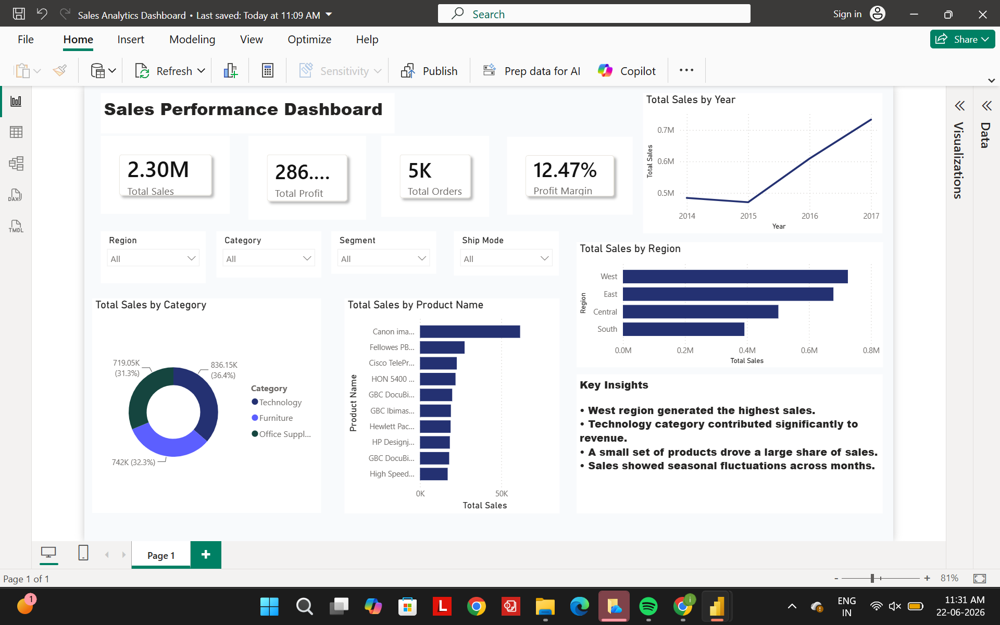

# Retail Sales Analytics Dashboard

## Overview
Interactive Power BI dashboard analyzing retail sales, profit, orders, and product performance.

## Tools Used
- Power BI
- DAX
- Excel

## KPIs
- Total Sales
- Total Profit
- Total Orders
- Profit Margin

## Features
- Regional Sales Analysis
- Monthly Sales Trends
- Category Performance Analysis
- Top Selling Products
- Interactive Filters and Slicers

## Key Insights
- West region generated the highest sales.
- Technology category contributed the largest share of revenue.
- Top-selling products drove a significant portion of revenue.
- Sales increased steadily from 2015 to 2017.

## Dashboard Preview

